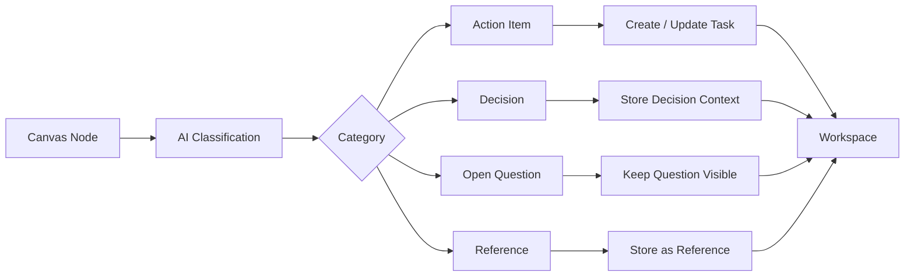
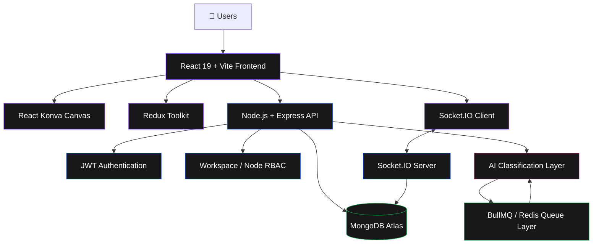
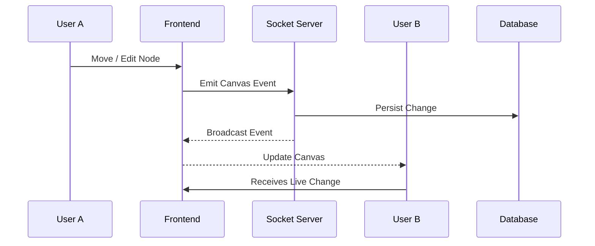
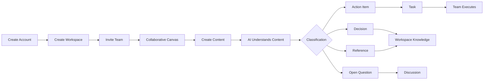

<div align="center">

# ✦ SCRYBE

### **Think. Draw. Collaborate. Let AI organize the rest.**

An AI-powered collaborative workspace that turns ideas, discussions, and visual thinking into **structured actions, decisions, questions, and tasks** — all inside one infinite canvas.

<br/>

**`Collaborative Canvas` · `AI Classification` · `Task Management` · `Real-Time Sync` · `Workspace RBAC`**

<br/>


</div>

---

## ◈ What is Scrybe?

> **Scrybe is a collaborative AI workspace built around an infinite canvas.**

Modern teams often jump between tools:

```text
Ideas → Miro
Messages → Slack
Tasks → Jira
Notes → Notion
AI → Another tab
```

Scrybe brings the workflow together:

```text
                         ┌──────────────────┐
                         │      SCRYBE      │
                         └────────┬─────────┘
                                  │
                 ┌────────────────┼────────────────┐
                 ▼                ▼                ▼
            ✦ Visualize       ✦ Collaborate    ✦ Organize
                 │                │                │
                 ▼                ▼                ▼
             Canvas          Real-Time Sync      Tasks
                 │                │                │
                 └────────────────┼────────────────┘
                                  ▼
                           ┌──────────────┐
                           │   AI LAYER   │
                           └──────┬───────┘
                                  │
              ┌───────────────────┼───────────────────┐
              ▼                   ▼                   ▼
          Action Item          Decision          Open Question
              │                   │                   │
              └───────────────────┼───────────────────┘
                                  ▼
                         Structured Workspace
```

Instead of forcing users to organize everything manually, Scrybe helps transform unstructured collaboration into **actionable knowledge**.

---

# ✦ Core Experience

<table>
<tr>
<td width="50%">

### 🎨 Infinite Canvas

Create and arrange:

* Sticky Notes
* Text Blocks
* Shapes
* Freehand drawings
* Arrows
* Visual connections

</td>
<td width="50%">

### 🤖 AI-Powered Understanding

Scrybe analyzes canvas content and classifies it into:

* **Action Item**
* **Decision**
* **Open Question**
* **Reference**

</td>
</tr>

<tr>
<td>

### ⚡ Real-Time Collaboration

Multiple users can work inside the same workspace with:

* Live canvas updates
* Presence
* Socket-based synchronization
* Collaborative editing

</td>
<td>

### ✅ Automatic Task Creation

When an AI-classified item represents an action, Scrybe can transform it into a structured task instead of making the user manually copy information into another tool.

</td>
</tr>
</table>

---

# ◈ Why Scrybe?

### The old workflow

```text
┌────────────┐
│ Brainstorm │
└─────┬──────┘
      ↓
┌────────────┐
│   Canvas   │
└─────┬──────┘
      ↓
   Copy/Paste
      ↓
┌────────────┐
│    Chat    │
└─────┬──────┘
      ↓
   Copy/Paste
      ↓
┌────────────┐
│    Tasks   │
└────────────┘
```

### The Scrybe workflow

```text
┌─────────────────────────────────────────────┐
│                  SCRYBE                     │
│                                             │
│  CREATE → COLLABORATE → UNDERSTAND → ACT   │
│                                             │
└─────────────────────────────────────────────┘
                       │
                       ▼
                ┌─────────────┐
                │ AI Analysis │
                └──────┬──────┘
                       │
          ┌────────────┼────────────┐
          ▼            ▼            ▼
       ACTION       DECISION     QUESTION
          │            │            │
          ▼            ▼            ▼
        TASK        CONTEXT       DISCUSS
```

**Less context switching.
Less copying.
Less lost information.**

---

# ✦ Feature Map

| Area             | Capability                                       |
| ---------------- | ------------------------------------------------ |
| 🧠 Workspace     | Create and manage collaborative workspaces       |
| 👥 Collaboration | Invite Contributors and Viewers                  |
| 🎨 Canvas        | Infinite collaborative visual workspace          |
| 📝 Nodes         | Sticky notes, text, shapes, freehand, arrows     |
| 🤖 AI            | Automatically classify canvas content            |
| ✅ Tasks          | Convert actionable content into structured tasks |
| 🔐 Permissions   | Workspace + node-level access control            |
| ⚡ Realtime       | Socket.IO-powered synchronization                |
| 👤 Presence      | Know who is currently collaborating              |
| 📜 Events        | Track important workspace activity               |
| ⏪ History        | Event/time-travel architecture                   |
| 📧 Invitations   | Workspace invitation workflow                    |
| 🗄️ Persistence  | MongoDB-backed workspace and canvas data         |

---

# ◈ AI Classification Pipeline

Scrybe's AI layer is designed around one simple idea:

> **Don't make users organize their thoughts before they can act on them.**



### Classification categories

```text
┌──────────────────┬─────────────────────────────────────┐
│ ACTION ITEM      │ Something that needs to be done     │
├──────────────────┼─────────────────────────────────────┤
│ DECISION         │ Something the team has decided      │
├──────────────────┼─────────────────────────────────────┤
│ OPEN QUESTION    │ Something that still needs clarity  │
├──────────────────┼─────────────────────────────────────┤
│ REFERENCE        │ Useful contextual information       │
└──────────────────┴─────────────────────────────────────┘
```

---

# ✦ Architecture



---

# ◈ Technology Stack

### Frontend

```text
React 19
Vite
React Router
Redux Toolkit
React Konva
Axios
Socket.IO Client
```

### Backend

```text
Node.js
Express.js
Socket.IO
JWT
bcrypt
Mongoose
```

### Data & Infrastructure

```text
MongoDB Atlas
Redis
BullMQ
Docker
Docker Compose
```

### AI

```text
OpenRouter
LLM-based content classification
Structured classification categories
AI → Task automation pipeline
```

---

# ✦ Real-Time Collaboration

Scrybe uses Socket.IO to synchronize collaborative activity.



The goal is simple:

**If one person changes the workspace, everyone else should see it.**

---

# ◈ Workspace & Permissions

Scrybe uses a workspace-based collaboration model.

```text
                    WORKSPACE
                        │
             ┌──────────┼──────────┐
             │          │          │
           LEAD     CONTRIBUTOR   VIEWER
             │          │          │
             ▼          ▼          ▼
          Manage      Edit       Observe
          Workspace   Canvas     Canvas
          Members     Content
             │          │
             └──────┬───┘
                    ▼
              Node Permissions
```

### Roles

| Role            | Workspace    | Canvas      | Collaboration  |
| --------------- | ------------ | ----------- | -------------- |
| **Lead**        | Full control | Full access | Manage members |
| **Contributor** | Limited      | Edit        | Collaborate    |
| **Viewer**      | View         | View        | Observe        |

The architecture also supports **node-level permissions**, allowing access control to exist beyond the workspace level.

---

# ✦ Event-Driven Design

Important workspace actions can be represented as events.

```text
USER ACTION
    │
    ▼
┌─────────────────┐
│ Workspace Event │
└────────┬────────┘
         │
         ├──────► Canvas State
         │
         ├──────► Event Log
         │
         ├──────► Realtime Broadcast
         │
         └──────► AI / Task Pipeline
```

This provides the foundation for:

* Activity history
* Auditing
* Time travel
* Collaboration tracking
* Future undo/history capabilities

---

# ◈ Queue Architecture

Scrybe's backend architecture is designed to keep expensive/background work away from the main request cycle.

```text
                     API
                      │
          ┌───────────┼───────────┐
          ▼           ▼           ▼
     Classification   Task       Email
        Queue         Queue      Queue
          │           │           │
          └───────────┼───────────┘
                      ▼
                    Redis
                      │
             ┌────────┴────────┐
             ▼                 ▼
      Classification       Background
         Worker              Worker
```

Planned / integrated queue modules include:

```text
classification.queue.js
task.queue.js
email.queue.js
audit.queue.js
```

---

# ✦ Project Structure

```text
Scrybe/
│
├── Ligma_backend/
│   │
│   ├── controllers/
│   ├── models/
│   ├── routes/
│   ├── middleware/
│   ├── services/
│   ├── workers/
│   ├── queues/
│   ├── utils/
│   ├── config/
│   │
│   ├── index.js
│   ├── package.json
│   └── .env
│
├── Ligma_frontend/
│   │
│   └── Frontend/
│       ├── src/
│       │   ├── components/
│       │   ├── pages/
│       │   ├── features/
│       │   ├── hooks/
│       │   ├── services/
│       │   ├── store/
│       │   └── utils/
│       │
│       ├── public/
│       ├── package.json
│       └── vite.config.js
│
├── Ligma_docs/
│   ├── PRD
│   ├── TRD
│   ├── UI-UX
│   └── Architecture
│
├── docker-compose.yml
└── README.md
```

> Folder names may evolve as the project continues to grow.

---

# ◈ Local Development

## 1. Clone

```bash
git clone <your-repository-url>
cd Scrybe
```

## 2. Install frontend dependencies

```bash
cd Ligma_frontend/Frontend
npm install
```

## 3. Install backend dependencies

```bash
cd ../../Ligma_backend
npm install
```

## 4. Configure environment variables

### Backend

```env
PORT=5000

MONGODB_URI=your_mongodb_connection_string

JWT_SECRET=your_jwt_secret

OPENROUTER_API_KEY=your_openrouter_api_key

REDIS_URL=your_redis_url
```

### Frontend

```env
VITE_API_URL=your_backend_url
VITE_SOCKET_URL=your_backend_url
```

> Never commit `.env` files or API keys to the repository.

---

# ✦ Docker

Scrybe can be run using Docker Compose.

```bash
docker compose up --build
```

To run in detached mode:

```bash
docker compose up -d --build
```

To stop services:

```bash
docker compose down
```

To inspect running containers:

```bash
docker ps
```

---

# ◈ Deployment

Current deployment architecture:

```text
                         INTERNET
                            │
                 ┌──────────┴──────────┐
                 │                     │
                 ▼                     ▼
             Vercel                  Render
            Frontend                Backend
                 │                     │
                 │                 Socket.IO
                 │                     │
                 └──────────┬──────────┘
                            │
                            ▼
                     MongoDB Atlas
                            │
                            ▼
                          Redis
```

### Production responsibilities

| Service           | Responsibility                        |
| ----------------- | ------------------------------------- |
| **Vercel**        | React frontend                        |
| **Render**        | Node.js backend + API                 |
| **MongoDB Atlas** | Persistent application data           |
| **Redis**         | Queue / background-job infrastructure |

---

# ✦ Security

Scrybe's backend is designed around several security layers:

```text
Request
   │
   ▼
Authentication
   │
   ▼
JWT Verification
   │
   ▼
Workspace Membership
   │
   ▼
Role Permission
   │
   ▼
Node Permission
   │
   ▼
Controller / Service
```

Key concepts include:

* JWT-based authentication
* Password hashing with bcrypt
* Workspace membership validation
* Role-based permissions
* Node-level access control
* Environment-based secrets
* Server-side authorization

---

# ◈ Product Flow

The complete Scrybe experience can be visualized as:



---

# ✦ Design Philosophy

Scrybe follows a **calm control-room** design philosophy.

### Visual language

```text
┌──────────────────────────────────────────┐
│                                          │
│        DARK / NEUTRAL CHROME             │
│                                          │
│      ┌────────────────────────────┐      │
│      │                            │      │
│      │       INFINITE CANVAS      │      │
│      │                            │      │
│      │   ◼        ◼        ◼     │      │
│      │                            │      │
│      └────────────────────────────┘      │
│                                          │
│     Indigo / Violet Accent System         │
│     Pastel Content Nodes                  │
│     Minimal AI Surface                    │
│                                          │
└──────────────────────────────────────────┘
```

The AI is intentionally integrated into the workflow rather than becoming a separate "AI screen".

**The canvas stays the workspace. AI stays the assistant.**

---

# ◈ What Makes It Different?

### Traditional collaboration

```text
Human creates information
        ↓
Human categorizes information
        ↓
Human copies information
        ↓
Human creates task
        ↓
Human updates another tool
```

### Scrybe

```text
Human creates information
        ↓
        AI understands it
        ↓
Information becomes structured
        ↓
Task / Decision / Question / Reference
        ↓
Team continues working
```

---

# ✦ Roadmap

```text
PHASE 01 ─ Foundation
████████████████████████████  100%

PHASE 02 ─ Collaborative Canvas
██████████████████████████░░   90%

PHASE 03 ─ AI Classification
████████████████████████░░░░   85%

PHASE 04 ─ Task Automation
███████████████████░░░░░░░░░   70%

PHASE 05 ─ Advanced Collaboration
██████████████░░░░░░░░░░░░░░   55%

PHASE 06 ─ Analytics & Insights
███████░░░░░░░░░░░░░░░░░░░░░   25%
```

### Future possibilities

* [ ] Advanced canvas history
* [ ] Time-travel workspace state
* [ ] Advanced presence indicators
* [ ] Rich task management
* [ ] AI-powered workspace summaries
* [ ] AI meeting → canvas workflows
* [ ] Smart recommendations
* [ ] Advanced analytics
* [ ] More collaboration primitives
* [ ] Production-grade observability

---

# ◈ Built For

Scrybe is particularly useful for:

```text
🧠 Brainstorming
🎯 Project Planning
👥 Team Collaboration
🚀 Product Development
📋 Task Discovery
💡 Idea Management
🔎 Decision Tracking
🗺️ Visual Workflows
```

---

# ✦ Engineering Principles

### 01 — Collaboration First

The canvas is designed around multiple people, not a single-user whiteboard.

### 02 — AI Should Reduce Work

AI should remove repetitive organization, not create another interface users have to manage.

### 03 — Structured From Unstructured

Ideas don't have to begin as tasks, databases, or forms.

### 04 — Permission Aware

Collaboration requires controlled access at workspace and content levels.

### 05 — Events Are Valuable

Important actions should be observable, traceable, and eventually reversible.

---

# ◈ Performance Mindset

The architecture is designed to separate:

```text
FAST REQUESTS
    │
    ├── Authentication
    ├── Workspace operations
    ├── Canvas updates
    └── Realtime events

BACKGROUND WORK
    │
    ├── AI classification
    ├── Task automation
    ├── Email processing
    └── Audit processing
```

This keeps the interactive experience responsive while heavier workloads can move through background workers.

---

# ✦ Project Status

<div align="center">

### 🚧 Scrybe is actively evolving.

Built as an AI-powered collaborative workspace with a focus on:

**Visual Collaboration × AI × Automation**

<br/>

**From messy ideas → to organized action.**

<br/>

### `✦ Think less about organizing. Do more about building.`

</div>

---

# ◈ Documentation

Detailed project documentation is maintained inside:

```text
Ligma_docs/
```

Including:

```text
PRD
TRD
UI/UX Specifications
Architecture
Database Design
Technical Decisions
Implementation Notes
```

---

# ✦ Acknowledgements

Scrybe is built with an ecosystem of open-source technologies including:

**React · Vite · Node.js · Express · MongoDB · Socket.IO · Redux Toolkit · React Konva · Redis · BullMQ · Docker**

---

<div align="center">

## ✦ SCRYBE

**Collaborate visually.
Understand automatically.
Act together.**

<br/>

`Built with React · Node.js · MongoDB · AI`

</div>
